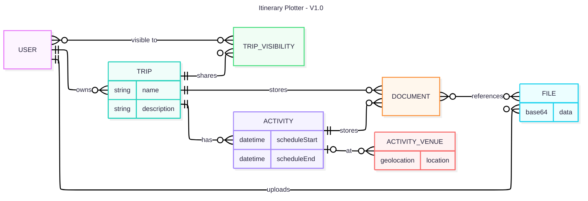

# Charts

## ERD

```mermaid
---
config:
  layout: elk
  look: neo
  theme: redux-color
title: Itinerary Plotter - V1.0
---
erDiagram
	direction LR
	USER {
	}
	TRIP {
		string name  ""  
		string description  ""  
	}
	DOCUMENT {
	}
	FILE {
		base64 data
	}
	TRIP_VISIBILITY {
	}
	ACTIVITY {
		datetime scheduleStart
		datetime scheduleEnd
	}
	ACTIVITY_VENUE {
		geolocation location
	}

	USER||--o{TRIP:"owns"
	USER||--o{FILE:"uploads"
	TRIP||--o{TRIP_VISIBILITY:"shares"
	TRIP_VISIBILITY}o--o{USER:"visible to"
	TRIP||--o{DOCUMENT:"stores"
	TRIP||--o{ACTIVITY:"has"
	ACTIVITY||--o{DOCUMENT:"stores"
	ACTIVITY|o--o{ACTIVITY_VENUE:"at"
	DOCUMENT}o--o{FILE:"references"

```
