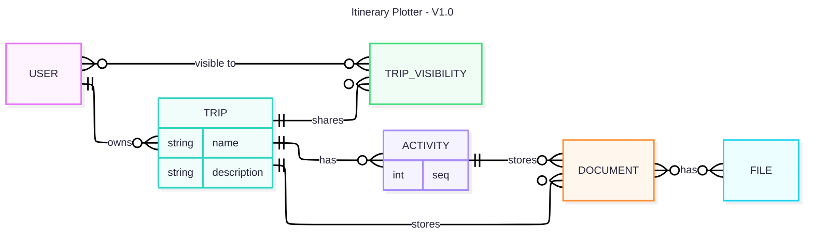

# Itinerary Plotter API

## Tech Stack

- express.js
- prisma + kysely
- express-sessions + passport
- typescript

## Commands

### Start server

```bash
pnpm start
```

### Start in dev mode

```bash
pnpm dev
```

### Generate Prisma Schema

```bash
pnpm prisma:generate
```

### Migrate Schema Changes

```bash
pnpm prisma:migrate:dev
```

### Format repository

```bash
pnpm prettier
```

## Charts

### ERD


